# Project 2 Badminton Basics
Check out the deployed Badminton Basics (https://heli-t-00.github.io/Project2_badmintonCourt/)

## Table of Contents
### 1. [Introduction](#Introduction)
### 2. [Desired Outcome](#desired-outcome)
### 3. [Proposed Features](#proposed-features)
### 4. [Wireframe](#wireframe)
### 5. [Design](#design)
### 6. [Features and Responsitivity](#features-and-responsitivity)
### 7. [Testing](#testing)
### 8. [GitHub Deployment](#github-deployment)
### 9. [Future Improvements](#future-improvemnts)
### 10.[Credits](#credits)

# Introduction 

For my second project in the tech bootcamp, I will build upon my first project, [Project 1] (https://heli-t-00.github.io/Project1_NPBadminton/), by creating an interactive badminton court using a front-end web application developed with HTML, CSS, and JavaScript. 
This project aligns with the EPIC (Easily-Accessible, Purposeful, Interactive, and Consistent) approach and aims to deliver an engaging and user-friendly experience for those who are new to badminton and want to know the badminton basics.

The primary goal is to display the rules of the game interactively, focusing on accessibility and responsivity. The application will ensure compatibility across devices by designing with a mobile-first approach. Leveraging CSS, I will implement CSS grids to construct the badminton court, ensuring scalability for various screen sizes.

# Desired Outcome
###### [Back to the top](#table-of-contents)
The interactive badminton court will allow users to:

- Identify specific areas of the court such as play zones or service areas.
- Learn key rules visually, such as which areas are valid for singles play or doubles play.
- Experience animations that demonstrate court usage (e.g., valid service areas).
- Interact with tooltips providing additional information about court regions.

This project intends to satisfy the following objectives:

- LO1: Design an interactive front-end web application based on UX design principles, accessibility, and responsivity.
- LO2: Test the application thoroughly during development, implementation, and deployment phases.
- LO3: Deploy the web application to a cloud platform for public access.
- LO4: Maximise future maintainability through clear documentation and organised code structure.
- LO5: Document the development process using version control tools like GitHub.
- LO6: Implement front-end interactivity using core JavaScript and advanced features.

# Proposed Features
## Interactive Badminton Court: Users can click areas of interest on the court to learn the rules.
### User Story - Single Court Player:
- As a new user, I want to...'Identify valid play areas for single player game'.
- As a new user, I want to... 'Identify service areas for single player game'.
### User Story - Double Court Players:
- As a new user, I want to... 'Identify valid play areas for double players game'.
- As a new user, I want to... 'Identify service areas for double players game'.

* Use animation, to illustrate service zones.
* Additional Feature:
    - a test for user to check whether they can identify service area
    - a test to identify areas of the court

This project will demonstrate my ability to integrate technical knowledge with design principles to create an accessible and responsive web application.

# WireFrame
###### [Back to the top](#table-of-contents)
When designing the website, my focus was on creating an intuitive experience. I want the users to immediately understand the purpose of the page, even if they arrived via a quick Google search. The wireframe was crafted with a mobile-first approach, ensuring a seamless user experience across devices. The webpage will carry the same header and logo and theme of the first project to ensure it is a seemly transition to the court.html page.

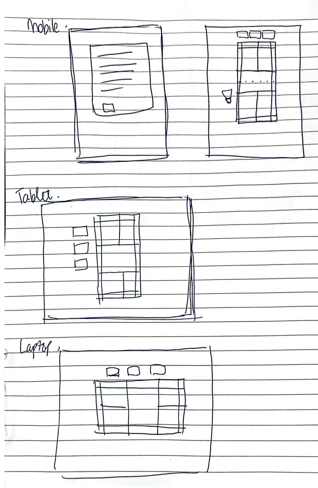

# Design
###### [Back to the top](#table-of-contents)
The website’s design prioritised on simplicity and intuitiveness, reflecting my goal to create a seamless and engaging user experience. Guided by core UX design principles, I focused on building an interactive front-end web application that is accessible, responsive, and user-friendly:

- User-Centered Design: 
The website is tailored to the needs and behaviors of its target audience, ensuring that every feature and interaction aligns with user expectations. 
- Clarity and Consistency: 
The layout is clean and organized, with readable typography, intuitive navigation, and a uniform style. This consistency helps users quickly recognize patterns and feel confident in their interactions.
- Accessibility: 
Every element of the site is designed to be inclusive, meeting accessibility standards. Features such as descriptive alt text for images, high-contrast color schemes, and keyboard navigability ensure the website is usable for people of all abilities. The website responds to touch / mouse / keyboard events.
- Responsiveness: The design aims adapts seamlessly to different screen sizes and devices, maintaining functionality and visual appeal whether accessed on mobile, tablet, or desktop.
- Feedback and Usability: 
Interactive elements provide immediate feedback, such as hover effects and form submission confirmations, ensuring users understand the outcomes of their actions. Usability testing further refined the design, eliminating pain points to enhance the overall experience.
- Simplicity and Findability: 
By eliminating unnecessary complexity, the website highlights essential features and makes navigation straightforward. Clear categorization and search functionality help users easily locate the information they need.
This deliberate approach to design ensured that the website not only met its primary objective of interactivity but also delivered an intuitive, inclusive, and aesthetically pleasing experience grounded in UX best practices.

# Features and Responsitivity
## Features Breakdown
###### [Back to the top](#table-of-contents)
1. Interactive Badminton Court
- Shuttle can move within the Court Areas
- Used clear color-coding to differentiate between service zones, valid play areas, and out-of-bound zones.
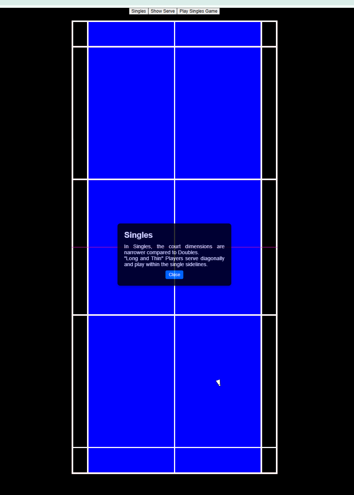
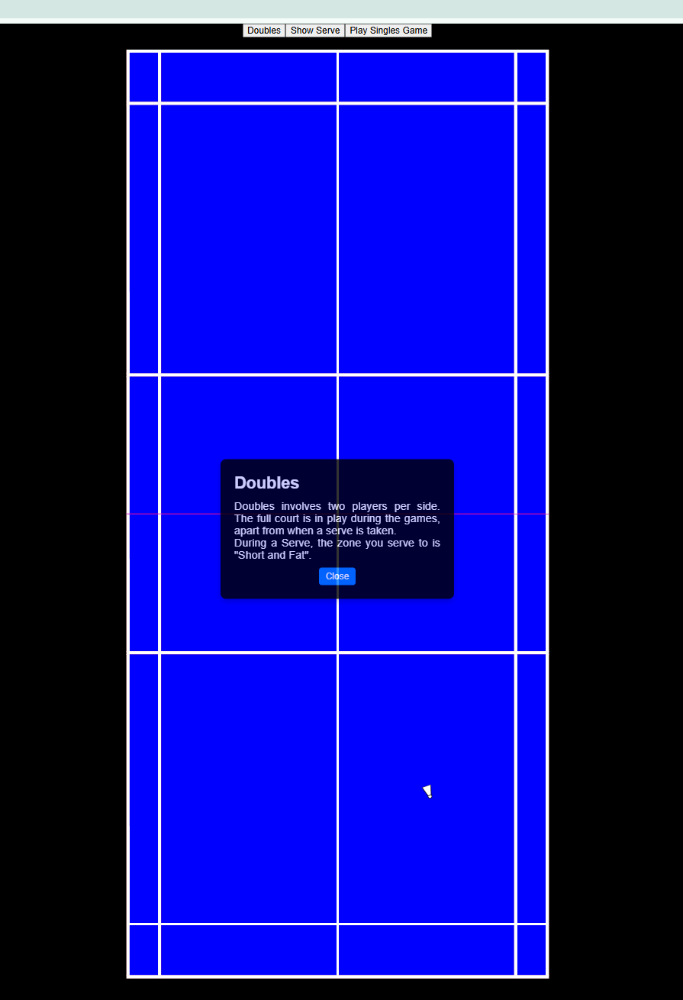
2. Animation for Service Zones
- Highlight the service zones using a fading-in/out effect or directional arrows for better visualization.
- Incorporate animations that display the transition of zones during singles and doubles matches.
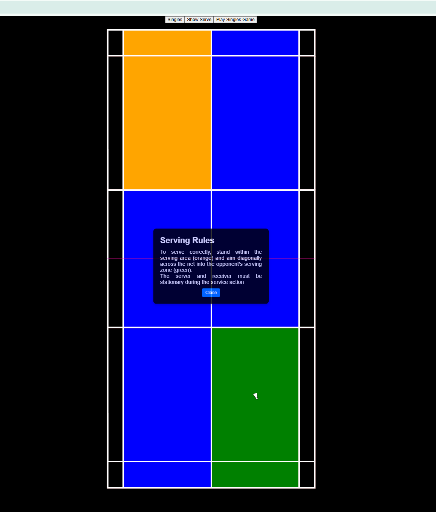
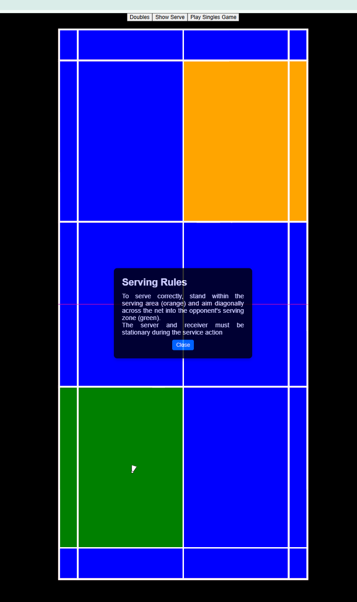

###### [Back to the top](#table-of-contents)

## User Stories Implementation
- Single Court Player
Add overlays for valid play and service areas specific to a singles game.
Use toggle switches to allow users to switch between "Singles" and "Doubles" views.

- Double Court Players
Expand the service area animations to show how they differ for doubles.

- Additional Features
Tests for Learning Outcomes: for Singles play only.
Interactive Quiz for Service Area Identification:
Display multiple court zones and ask users to click the correct service area based on specific scenarios.
- Provide immediate feedback (correct/incorrect).
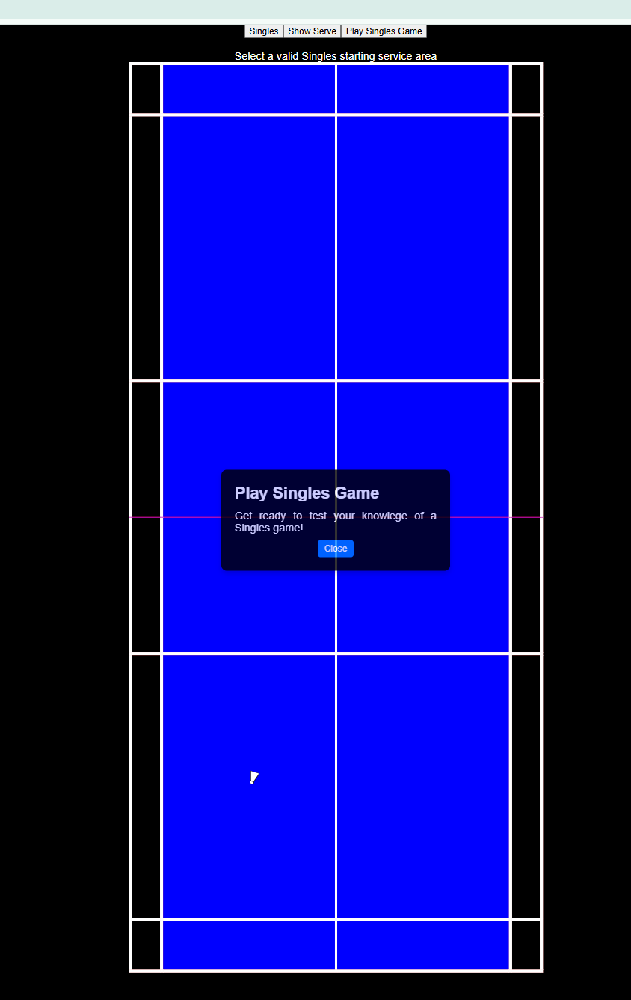
Test for Valid Play Areas:
Present an empty court where users can mark areas they believe are valid play zones.
Include a “Check Answer” button to show correct areas with explanations.

# Testing
###### [Back to the top](#table-of-contents)
To ensure all features work as intended. The following test was performed
## Responsive
The website used [Am I Responsive](https://ui.dev/amiresponsive?url=https://heli-t-00.github.io/Project2_badmintonCourt/)

## Browser Friendly
The site has been tested for the following browsers: Chrome, Firefox, Edge, Vivaldi, Brave, and Tor Browser.
Checked use this [Browserling.com](https://www.browserling.com/browse/win10/tor13.5/https://heli-t-00.github.io/Project2_badmintonCourt/)
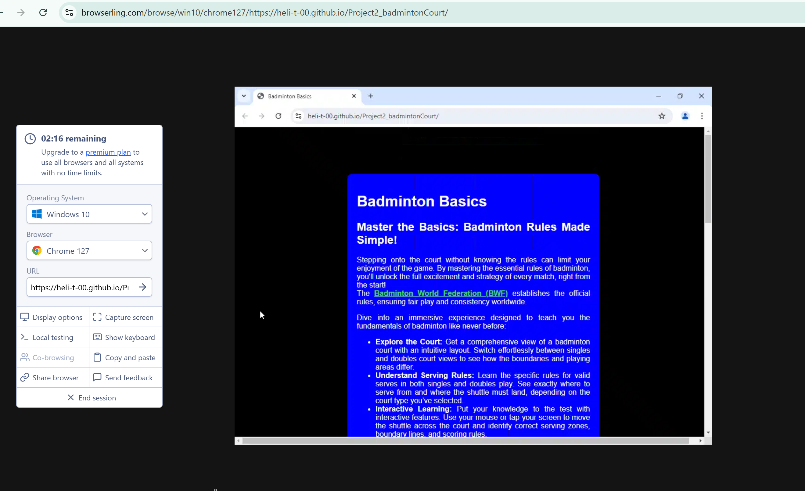

## Accessible - Lighthouse test 
Used this to test the quality of the website. Providing a comprehensive audit of the website's performances, accessibility, SEO (Search Engine Optimisation), best practices, and Progressive Web App (PWA) capabilities. 
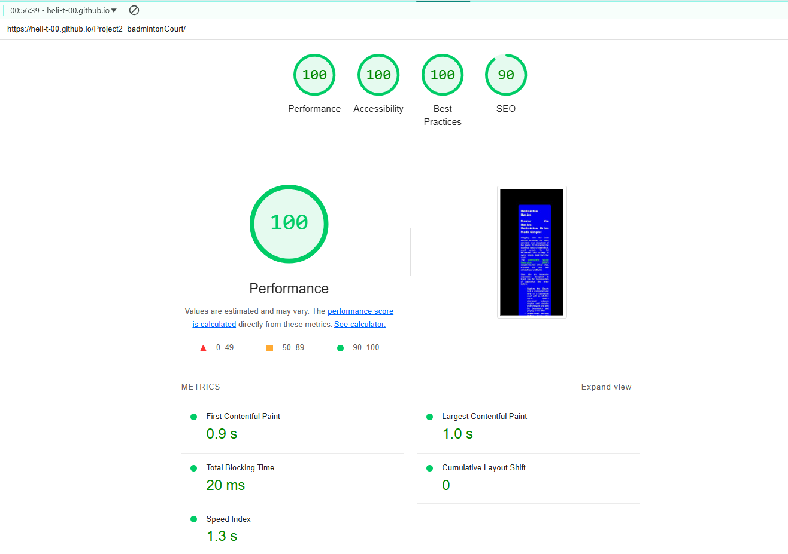
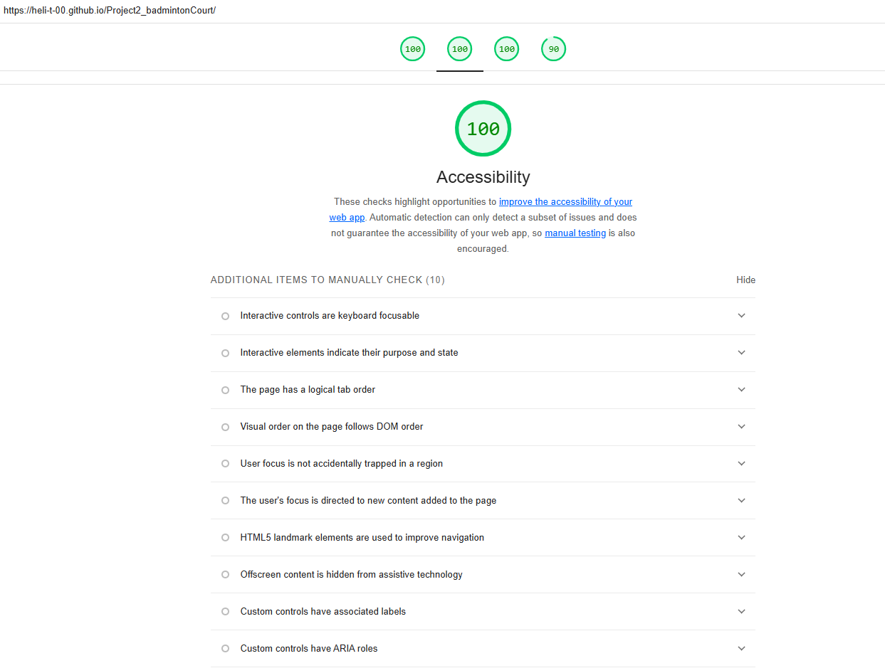

## Validator Testing
### HTML & CSS & JavaScript
No errors were returned when passing through the official [W3C Nu HTML Checker](https://validator.w3.org/nu/).
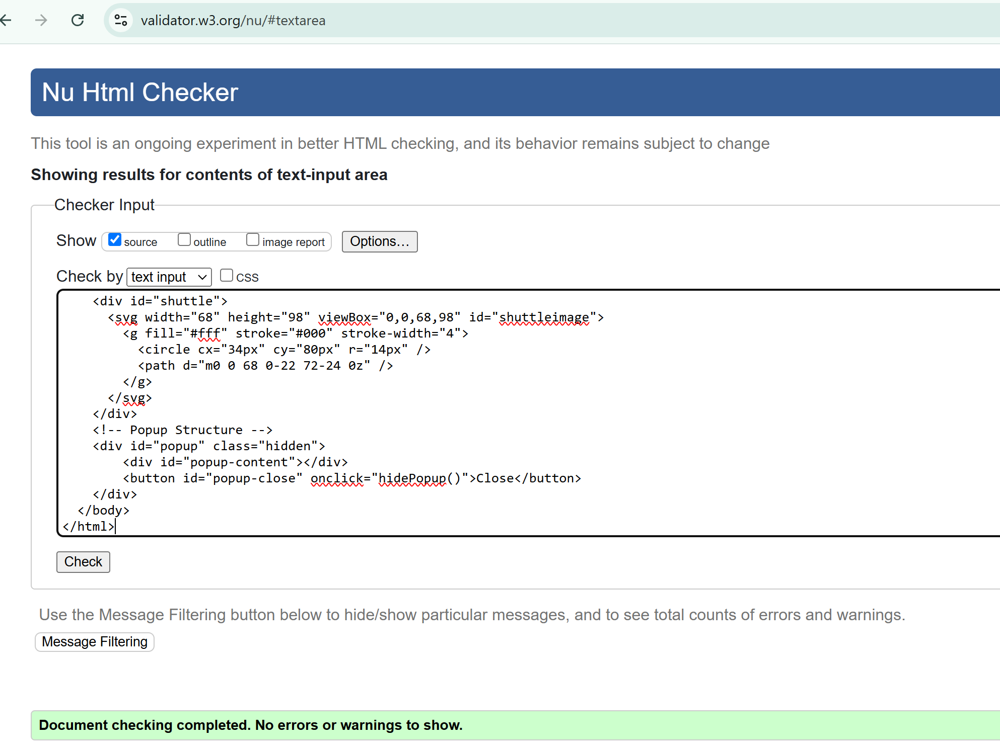

No errors were found when passing through the official validator - [W3C CSS Validator](https://jigsaw.w3.org/css-validator/validator). The document validates as CSS level 3 + SVG.
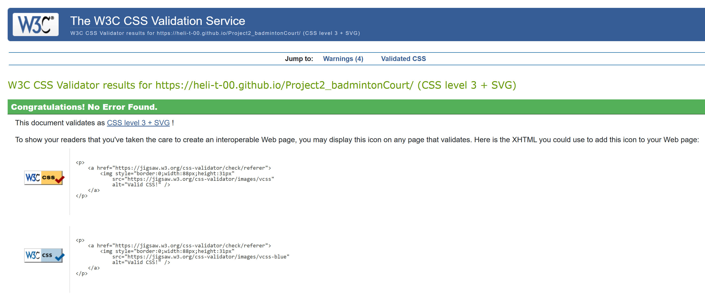
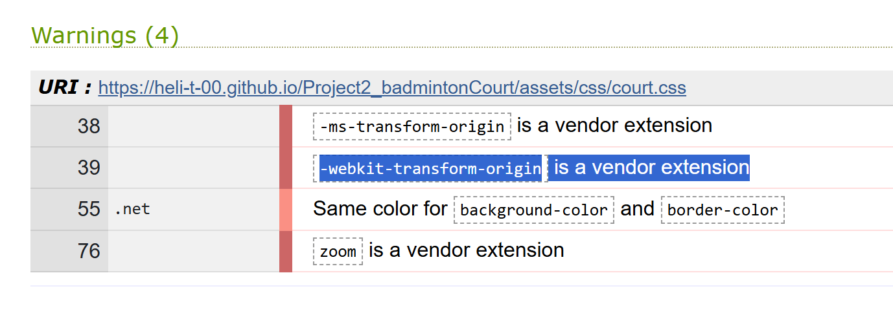
There were warnings, which has been checked and resolved."vendor extesnion" means that the property is specific to a particular browser engine.

For JavaScript I installed SonarQube for IDE to check and validate the javascript code. 

# GitHub and Deployment
###### [Back to the top](#table-of-contents)
The site was deployed to GitHub pages. 
The steps to deploy are as follows:
In the GitHub repository, navigate to the Settings tab
From the source section drop-down menu, select the Master Branch
Once the master branch has been selected, the page will be automatically refreshed with a detailed ribbon display to indicate the successful deployment.

I have used GitHub to deploy the website. [Live Link](https://heli-t-00.github.io/Project2_badmintonCourt/)
Visual Studio Code editor from Microsoft to write the codes and linked to GitHub for deployment. 
Deploy the web application to a cloud platform for public access via [github](https://github.com/heli-t-00/Project2_badmintonCourt)
Maximised future maintainability through clear documentation (this readme file) and organised code structure, the three tech stack used, html, css and javascript has their own files and each has clear comments to allow future maintainability.

# Future Improvements
Here are future feature ideas to further improvements on this project:

- Enhanced Content: Expand on badminton rules to make the site a comprehensive learning resource - 
- Responsive Design: Ensure layouts adapt seamlessly for mobile users.
- Interactive Features: Add animations, quizzes, and labeled court areas for better understanding.
- Visual Clarity: Use high-contrast colors and larger fonts for improved readability.
- Gamification: Implement levels or rewards to keep learners engaged.
- Accessibility: Support keyboard navigation and screen readers to make the site inclusive.
- Clickable Court Areas: Create hover effects on specific court zones with tooltips or pop-ups explaining their rules.

# Credits
###### [Back to the top](#table-of-contents)
The following links and websites were used to asisst with my development of the code and content of the website.
Code Institute bootcamp materials, ChatGPT, W3 Schools was used as part of research to learn the concept of for loop, if/else statements, switch, functions.
* [W3 Schools](https://www.w3schools.com/)
* CSS Grid Layout Module https://www.w3schools.com/css/css_grid.asp 
* Javascript - changing background colours
https://www.youtube.com/watch?v=nWAupAORchs
https://www.youtube.com/watch?v=1hfradAOvYc

* SVG Tutorials 
https://www.w3schools.com/graphics/svg_intro.asp
https://www.youtube.com/watch?v=WzxBfkUtM1Y
https://webdesign.tutsplus.com/svg-viewport-and-viewbox-for-beginners--cms-30844t

* Shuttle shape button - https://travishorn.com/buttons-with-custom-shapes-cabdcde7dfd1
* Shuttle sizing guide / measurements - https://www.dimensions.com/element/badminton-shuttlecock#:~:text=Badminton%20Shuttlecocks%20have%20a%20head,the%20height%20of%20the%20head

* Code Reviewer: M.P (Friend who has not given permission to share his fullname)

Content: Basic badminton
* Badminton players and playing area: Playing area https://www.bbc.co.uk/bitesize/guides/z37j2p3/revision/2 
* Badminton court size & Layout guide: https://www.networldsports.co.uk/buyers-guides/badminton-court-guide 
* The badminton bible https://www.badmintonbible.com/rules/simple 
* Badminton Racket Review https://badminton-racket-review.com/blogs/news/the-basic-rules-of-badminton-a-complete-guide?srsltid=AfmBOoo5r_TSvwWOotnKWtKx1qUooksrATSlBHoDRASuwph3uQUF1xMg 

###### [Back to the top](#table-of-contents)