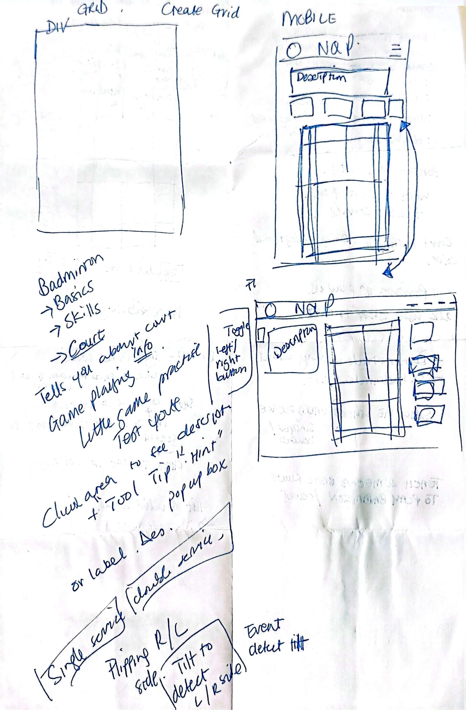
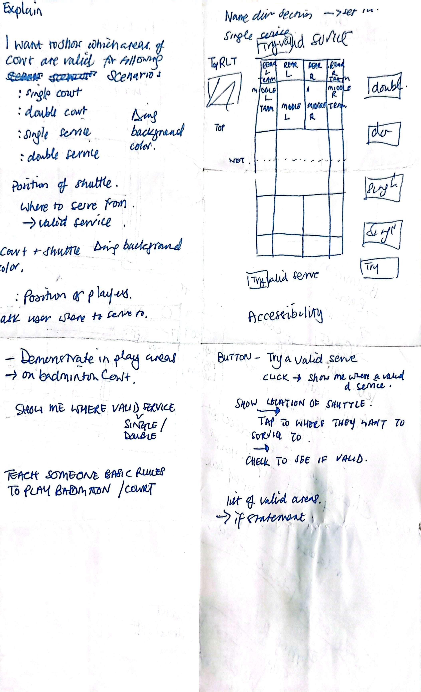
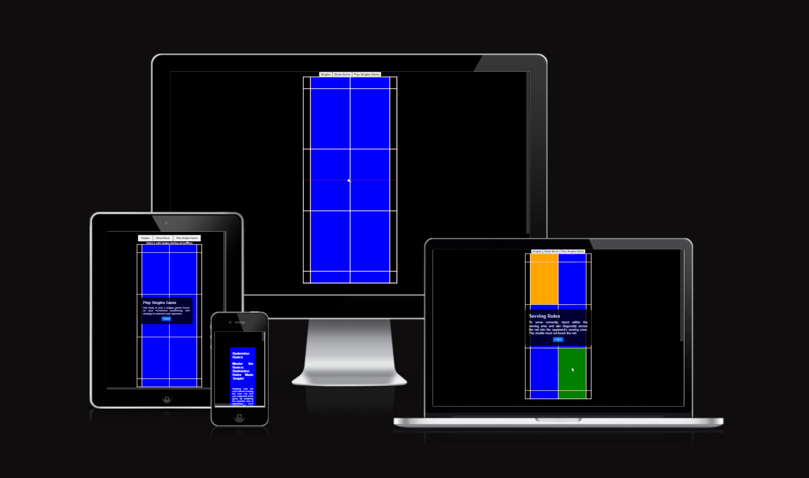

# Project 2 Badminton Basics
Check out the deployed Badminton Basics (https://heli-t-00.github.io/Project2_badmintonCourt/)

## Table of Contents
### 1.[Introduction](#Introduction)
### 2. [Desired Outcome](#desired-outcome)
### 3. [Proposed Features](#proposed-features)
### 4. [Wireframe](#wireframe)
### 5. [Design](#design)
### 6. [Features and Responsitivity](#features-and-responsitivity)
### 7. [Testing](#testing)
### 8. [GitHub Deployment](#github-deployment)
### 9. [Credits](#credits)

# Introduction 

For my second project in the tech bootcamp, I will build upon my first project, [Project 1] (https://heli-t-00.github.io/Project1_NPBadminton/), by creating an interactive badminton court using a front-end web application developed with HTML, CSS, and JavaScript. 
This project aligns with the EPIC (Easily-Accessible, Purposeful, Interactive, and Consistent) approach and aims to deliver an engaging and user-friendly experience for those who are new to badminton and want to know the badminton basics.

The primary goal is to display the rules of the game interactively, focusing on accessibility and responsivity. The application will ensure compatibility across devices by designing with a mobile-first approach. Leveraging CSS, I will implement CSS grids to construct the badminton court, ensuring scalability for various screen sizes.

# Desired Outcome
The interactive badminton court will allow users to:

- Identify specific areas of the court such as play zones or service areas.
- Learn key rules visually, such as which areas are valid for singles play or doubles play.
- Experience animations that demonstrate court usage (e.g., valid service areas).
- Interact with tooltips providing additional information about court regions.

This project intends to satisfy the following objectives:

- LO1: Design an interactive front-end web application based on UX design principles, accessibility, and responsivity.
- LO2: Test the application thoroughly during development, implementation, and deployment phases.
- LO3: Deploy the web application to a cloud platform for public access.
- LO4: Maximise future maintainability through clear documentation and organised code structure.
- LO5: Document the development process using version control tools like GitHub.
- LO6: Implement front-end interactivity using core JavaScript and advanced features.

# Proposed Features
## Interactive Badminton Court: Users can click areas of interest on the court to learn the rules.
### User Story - Single Court Player:
- As a new user, I want to...'Identify valid play areas for single player game'.
- As a new user, I want to... 'Identify service areas for single player game'.
### User Story - Double Court Players:
- As a new user, I want to... 'Identify valid play areas for double players game'.
- As a new user, I want to... 'Identify service areas for double players game'.

* Use animation, to illustrate service zones.
* Additional Feature:
    - a test for user to check whether they can identify service area
    - a test to identify areas of the court

This project will demonstrate my ability to integrate technical knowledge with design principles to create an accessible and responsive web application.

# WireFrame
When designing the website, my focus was on creating an intuitive experience. I want the users to immediately understand the purpose of the page, even if they arrived via a quick Google search. The wireframe was crafted with a mobile-first approach, ensuring a seamless user experience across devices. The webpage will carry the same header and logo and theme of the first project to ensure it is a seemly transition to the court.html page.

### Testing
To ensure all features work as intended. The following test was performed

### Responsive

The website is [Am I Responsive](https://ui.dev/amiresponsive?url=https://heli-t-00.github.io/Project2_badmintonCourt/)

### Browser Friendly

The site has been tested for the following browsers: Chrome, Firefox, Safari, Edge, Vivaldi, Brave, and Tor Browser.

Check use this [Browserling.com]

### Accessible

checked accessibility using Lighthouse tool on Google Dev tools.

### Validator Testing

HTML
No errors were returned when passing through the official [W3C Nu HTML Checker](https://validator.w3.org/nu/).

CSS
No errors were found when passing through the official validator - [W3C CSS Validator](https://jigsaw.w3.org/css-validator/validator). The document validates as CSS level 3 + SVG.

### Credits
* Basic badminton information selected from  - 
* Badminton players and playing area: Playing area https://www.bbc.co.uk/bitesize/guides/z37j2p3/revision/2 
* Badminton court size & Layout guide: https://www.networldsports.co.uk/buyers-guides/badminton-court-guide 
* The badminton bible https://www.badmintonbible.com/rules/simple 
* Badminton Racket Review https://badminton-racket-review.com/blogs/news/the-basic-rules-of-badminton-a-complete-guide?srsltid=AfmBOoo5r_TSvwWOotnKWtKx1qUooksrATSlBHoDRASuwph3uQUF1xMg 
* CSS Grid Layout Module https://www.w3schools.com/css/css_grid.asp 

* Javascript - changing background colours
https://www.youtube.com/watch?v=nWAupAORchs
https://www.youtube.com/watch?v=1hfradAOvYc

* SVG Tutorials 
https://www.w3schools.com/graphics/svg_intro.asp
https://www.youtube.com/watch?v=WzxBfkUtM1Y
https://webdesign.tutsplus.com/svg-viewport-and-viewbox-for-beginners--cms-30844t

* Shuttle shape button - https://travishorn.com/buttons-with-custom-shapes-cabdcde7dfd1
* Shuttle sizing guide / measurements - https://www.dimensions.com/element/badminton-shuttlecock#:~:text=Badminton%20Shuttlecocks%20have%20a%20head,the%20height%20of%20the%20head

* Code Reviewer: M.P (Friend who has not given permission to share his fullname)